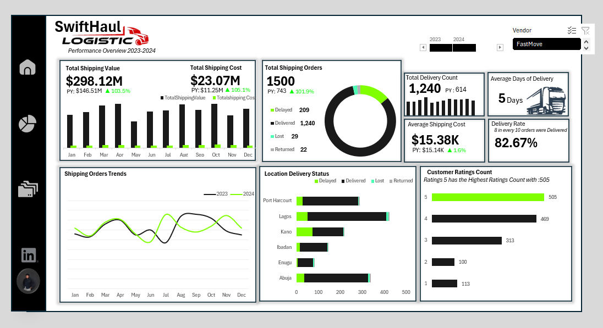
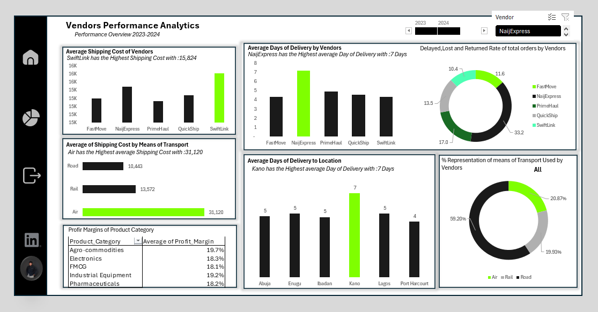

An end-to-end logistics analytics project built in Microsoft Excel, analyzing 1,500 shipments across 6 Nigerian cities, 5
vendors, and 5 product categories.

 Project Overview
SwiftHaul Logistics is a fictional Nigerian logistics company. This project analyzes two years of shipment data to
uncover operational bottlenecks, vendor inefficiencies, and regional delivery risks and presents findings through an
interactive two-page Excel dashboard.

Tools Used: 
. Microsoft Excel 
· Power Query 
· Pivot Tables
· Charts

Dataset: 1,500 shipment records · 2023–2024 · 16 fields

 File Structure
swifthaul-logistics-dashboard
 SwiftHaul_Logistics_Dataset.xlsx # Raw dataset
 SwiftHaul_Dashboard.xlsx # Final Excel dashboard
 README.md
 
 Dataset Schema
| Column | Description |
| Shipment_ID | Unique identifier per shipment |
| Date | Shipment date |
| Month / Quarter / Year | Time dimensions |
| Region | Delivery city (Lagos, Abuja, Kano, Port Harcourt, Ibadan, Enugu) |
| Vendor | Logistics vendor handling the shipment |
| Product_Category | Type of goods shipped |
| Transport_Mode | Road, Rail, or Air |
| Warehouse_Zone | Internal zone classification (A–D) |
| Delivery_Status | Delivered / Delayed / Lost / Returned |
| Delivery_Days | Days taken from dispatch to delivery |
| Shipment_Value_NGN | Value of goods shipped |
| Shipping_Cost_NGN | Cost charged for the shipment |
| Profit_Margin | Margin on the shipment |
| Customer_Rating | Rating given by recipient (1–5) |

 Key Findings
1. Overall Performance
• 1,500 total shipments processed across 2023–2024
• 82.67% delivery rate, roughly 1 in 6 shipments fails in some way
• Average delivery time: 5 days across all regions and vendors
• Total shipment value: 298.12M | Total shipping cost: 23.07M
• Failure rate (delayed + lost + returned) has remained flat at 15–18% across all 8 quarters — no improvement
trend over two years

3. Regional Risk — Kano is the Critical Outlier
• Kano has a 35.8% failure rate, nearly double every other region
• Every other region sits between 11–15%
• Average delivery to Kano: 7 days vs. the network average of 5
• This is a structural, localized problem requiring targeted intervention

5. Vendor Performance
| Vendor | Failure Rate | Avg Delivery Days | Avg Customer Rating |

| NaijExpress | 33.2% | 7 days | 3.36 |
| PrimeHaul | 17.0% | 5 days | 3.77 |
| QuickShip | 13.5% | 5 days | 3.83 |
| FastMove | 11.6% | 4 days | 3.93 |
| SwiftLink | 10.4% | 4 days | 3.97 |
• NaijExpress handles the most shipments (310) while performing the worst (a high-risk concentration)
• SwiftLink leads in reliability; 25% of their shipments use Air freight, explaining their speed advantage despite
higher shipping costs (avg 31K for Air vs 10K for Road)
4. Transport Mode & Cost Efficiency
| Mode | Avg Shipping Cost | Failure Rate | Cost as % of Shipment Value |

| Road | 10,443 | 17.5% | 20.6% |
| Rail | 13,572 | 17.4% | 31.2% |
| Air | 31,120 | 16.9% | 63.2% |
• Air freight costs 63% of shipment value on average — viable for high-value goods, value-destroying for FMCG
• For shipments above 500K, Air shows the lowest failure rate (9.5%) — the right use case
• Using Air for low-value shipments ( 20K–50K FMCG) is a significant margin drain

5. The Real Cost of Failures
• Lost shipments: 29 orders and worth 6.75M in shipment value
• Returned shipments: 22 orders · average margin of -11.7%
• Failed shipments are not zero-revenue events — they are net losses
• Delivered orders average 3.1 days; delayed orders average 13.1 days; lost/returned average 21+ days

7. Customer Ratings
• Ratings 1 and 2 combined account for 213 orders (17% of all shipments)
• Low ratings are strongly concentrated among delayed, lost, and returned orders
• Rating 5 (505 orders) correlates directly with on-time delivery

 Recommendations
1. Reduce NaijExpress volume immediately
Set a performance improvement threshold. Begin redistributing their order volume to SwiftLink and FastMove while a
formal review takes place. A 33% failure rate on the highest shipment volume in the network is not a vendor problem
it is an operational liability.
2. Investigate Kano as a standalone problem
The 35.8% failure rate is too anomalous to be explained by general network issues alone. Audit which vendors are
operating in Kano, whether the NaijExpress-Kano overlap is inflating that number, and what last-mile infrastructure
looks like in that corridor.
3. Implement a shipment value threshold for Air freight
Air freight should be reserved for shipments above 200–300K or for time-critical categories like Pharmaceuticals.
Applying it to FMCG and Agro-commodities destroys margins on already low-value goods.
4. Build early intervention for at-risk shipments
Shipments that reach 13+ days are far more likely to become losses. A tracking alert at Day 7 gives the operations
team a window to intervene before a delay becomes a lost shipment worth negative margin.
5. SwiftLink should be give more Order Percentage Considering the Fact that they are more realiable Than other Vendors
   
 How to Use the Dashboard
1. Download SwiftHaul_Dashboard.xlsx
2. Open in Microsoft Excel (2016 or later recommended)
3. Use the Vendor slicer (top right) to filter by individual vendor
4. Use the Year buttons to toggle between 2023, 2024, or both
5. Navigate between Page 1 (Overview) and Page 2 (Vendor Analytics) using the sheet tabs
   
 Author
Emmanuel Julius
Data Analyst · Kano, Nigeria
[LinkedIn](https://linkedin.com/in/emmanuel-julius-b13613378) · [X / Twitter](https://x.com/Cruxoferudition)--
*This is a portfolio project using a fictional dataset created for analytical practice.
